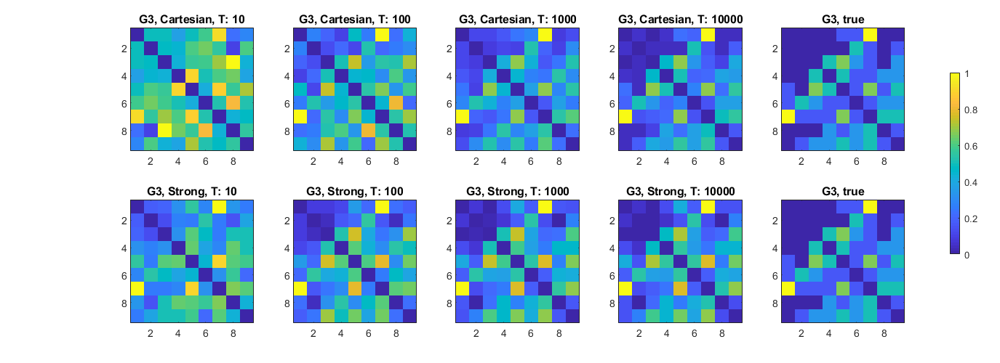

# ProdSpecTemp: Learning Product Graphs from Spectral Templates
This repository implements a demo for **learning product graphs** by recovering three factor graphs from a stream of product graph signals using the proposed **ProdSpecTemp**, similar to the Figures 2 and 3 in our paper [1]. In the case of finding its contents useful for your research work, kindly please cite our paper [1] addressed below. Thanks a lot for your attention.

[[1] Einizade, Aref, and Sepideh Hajipour Sardouie. "Learning Product Graphs from Spectral Templates." arXiv preprint arXiv:2211.02893 (2022).](https://arxiv.org/abs/2211.02893)

The codes were written in MATLAB 2018b, and the [GSPBOX](https://epfl-lts2.github.io/gspbox-html/) and [UNLocBoX](https://epfl-lts2.github.io/unlocbox-html/) toolboxes are also needed to run this demo.

- Run `Demo_ProdSpecTemp.m` to generate the desired results. 

Thanks a lot for your attention.
