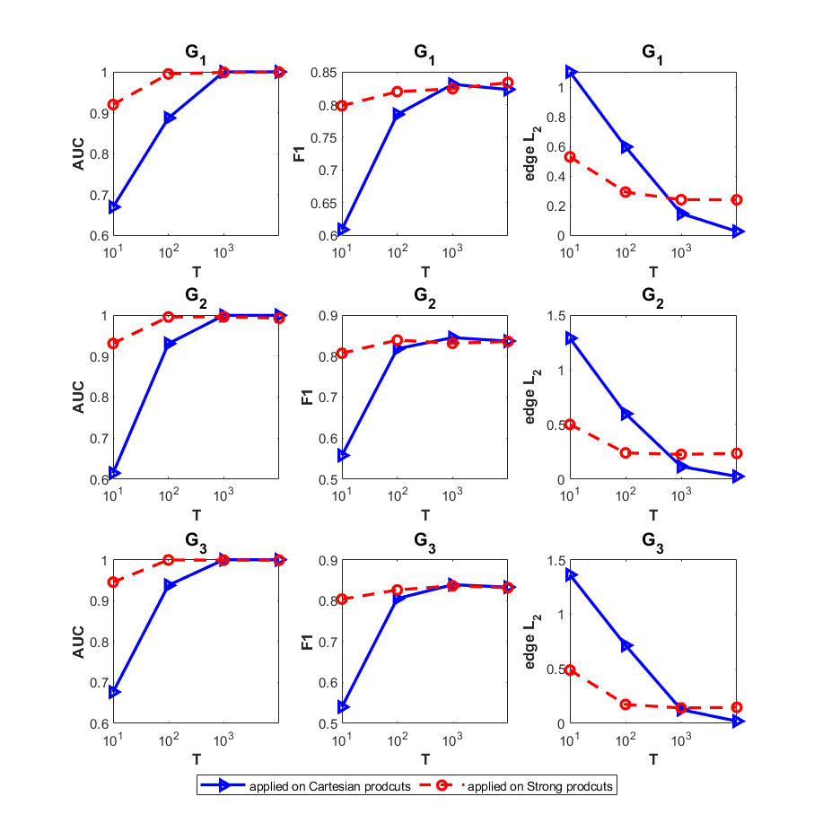

# ProdSpecTemp: Learning Product Graphs from Spectral Templates
This repository implements a demo for **learning product graphs** by recovering three factor graphs from a stream of product graph signals using the proposed **ProdSpecTemp**, similar to the Figures 2 and 3 in our paper [1]. In the case of finding its contents useful for your research work, kindly please cite our paper [1] addressed below. Thanks a lot for your attention.

[[1] A. Einizade and S. H. Sardouie, "Learning Product Graphs From Spectral Templates," in IEEE Transactions on Signal and Information Processing over Networks, vol. 9, pp. 357-372, 2023, doi: 10.1109/TSIPN.2023.3279513.](https://doi.org/10.1109/TSIPN.2023.3279513)

The codes were written in MATLAB 2018b, and the [GSPBOX](https://epfl-lts2.github.io/gspbox-html/) and [UNLocBoX](https://epfl-lts2.github.io/unlocbox-html/) toolboxes are also needed to run this demo.

- Run `Demo_ProdSpecTemp.m` to generate the desired results. 

  

Thanks a lot for your attention.
